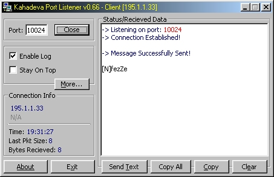



## Kahadeva Port Listener

### Description

Listen to a specific TCP port. Unfinished BETA version.
 
### More Info
 

             |
---                |---
**Submitted On**   |2000-07-06 19:26:38
**By**             |[fezZe](https://github.com/Planet-Source-Code/PSCIndex/blob/master/ByAuthor/fezze.md)
**Level**          |Beginner
**User Rating**    |4.7 (14 globes from 3 users)
**Compatibility**  |VB 3\.0, VB 4\.0 \(16\-bit\), VB 4\.0 \(32\-bit\), VB 5\.0, VB 6\.0, VB Script, ASP \(Active Server Pages\) 
**Category**       |[Complete Applications](https://github.com/Planet-Source-Code/PSCIndex/blob/master/ByCategory/complete-applications__1-27.md)
**World**          |[Visual Basic](https://github.com/Planet-Source-Code/PSCIndex/blob/master/ByWorld/visual-basic.md)
**Archive File**   |[CODE\_UPLOAD7435742000\.zip](https://github.com/Planet-Source-Code/fezze-kahadeva-port-listener__1-9501/archive/master.zip)

